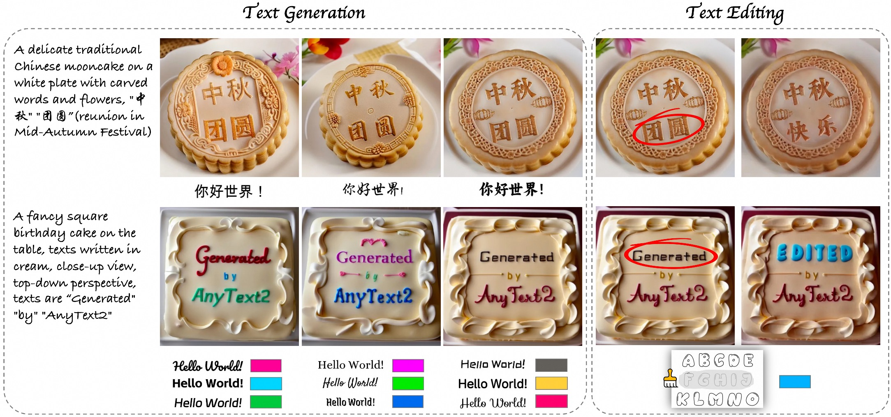
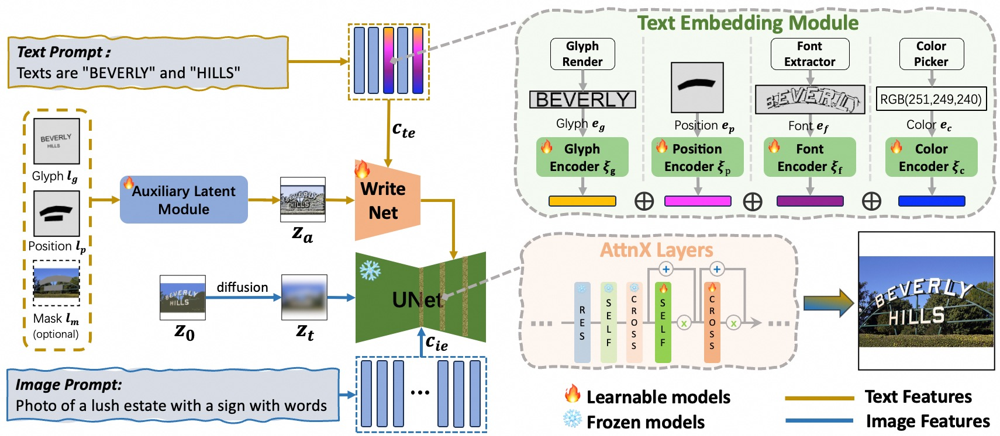

# AnyText2: Visual Text Generation and Editing With Customizable Attributes

<a href='https://arxiv.org/abs/2411.15245'></a> <a href='https://github.com/tyxsspa/AnyText2'></a> <a href='https://modelscope.cn/studios/iic/studio_anytext2'></a> <a href='https://huggingface.co/spaces/modelscope/AnyText2'></a>



## 📌News
[2025.02.28] - 🧨We release all code, checkpoint and dataset of AnyText2, and the online demo is available on [ModelScope](https://modelscope.cn/studios/iic/studio_anytext2)!  
[2024.11.22] - The paper is available at [arxiv](https://arxiv.org/abs/2411.15245).  


## ⏰TODOs

- [ ] Release SDXL version of AnyText2 (AnyText2XL)
- [x] Release inference/training/evaluation code, checkpoint, dataset of AnyText2
 

## 💡Methodology
AnyText comprises a diffusion pipeline with two primary elements: an auxiliary latent module and a text embedding module. The former uses inputs like text glyph, position, and masked image to generate latent features for text generation or editing. The latter employs an OCR model for encoding stroke data as embeddings, which blend with image caption embeddings from the tokenizer to generate texts that seamlessly integrate with the background. We employed text-control diffusion loss and text perceptual loss for training to further enhance writing accuracy.



## 🛠Installation
```bash
todo
```

## 🔮Inference


## 📈Evaluation


## 🚂Training


## Citation
```
@article{tuo2023anytext,
      title={AnyText: Multilingual Visual Text Generation And Editing}, 
      author={Yuxiang Tuo and Wangmeng Xiang and Jun-Yan He and Yifeng Geng and Xuansong Xie},
      year={2023},
      eprint={2311.03054},
      archivePrefix={arXiv},
      primaryClass={cs.CV}
}
```

```
@misc{tuo2024anytext2,
      title={AnyText2: Visual Text Generation and Editing With Customizable Attributes}, 
      author={Yuxiang Tuo and Yifeng Geng and Liefeng Bo},
      year={2024},
      eprint={2411.15245},
      archivePrefix={arXiv},
      primaryClass={cs.CV},
}
```