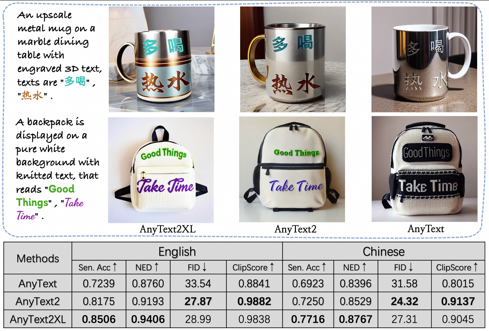

# AnyText2: Visual Text Generation and Editing With Customizable Attributes

<a href='https://arxiv.org/abs/2411.15245'></a> <a href='https://github.com/tyxsspa/AnyText2'></a> <a href='https://modelscope.cn/studios/iic/studio_anytext2'></a> <a href='https://huggingface.co/spaces/modelscope/AnyText2'></a>


## 📌News
[2025.03.01] - 🧨We release all code, checkpoint and dataset of AnyText2, and the online demo is available on [ModelScope](https://modelscope.cn/studios/iic/studio_anytext2)!  
[2024.11.22] - The paper is available at [arxiv](https://arxiv.org/abs/2411.15245).  


## ⏰TODOs

- [ ] Release SDXL version of AnyText2 (AnyText2XL)
- [x] Release inference/training/evaluation code, checkpoint, dataset of AnyText2
 

## 💡Methodology
AnyText comprises a diffusion pipeline with two primary elements: an auxiliary latent module and a text embedding module. The former uses inputs like text glyph, position, and masked image to generate latent features for text generation or editing. The latter employs an OCR model for encoding stroke data as embeddings, which blend with image caption embeddings from the tokenizer to generate texts that seamlessly integrate with the background. We employed text-control diffusion loss and text perceptual loss for training to further enhance writing accuracy.


## 🛠Installation
```bash
# Download checkpoint (pip install modelscope first)
from modelscope import snapshot_download
your_path_to_model_dir = snapshot_download('iic/cv_anytext2')
# Clone anytext code and move checkpoint
git clone https://github.com/tyxsspa/AnyText2.git
cd AnyText2 && mkdir -p models  &&  sleep 1 && mv your_path_to_model_dir/* models
# Create a new environment and install packages as follows:
conda env create -f environment.yaml
conda activate anytext2
```

## 🔮Inference

**[Recommend]**： We release a demo on [ModelScope](https://modelscope.cn/studios/damo/studio_anytext/summary)

If you have advanced GPU (with at least 8G memory), it is recommended to deploy our demo as below, which includes usage instruction, user interface and abundant examples.
```bash
python demo.py
```
The other parameters of run the demo are consistent with [AnyText](https://github.com/tyxsspa/AnyText?tab=readme-ov-file#inference).

## 📈Evaluation

The evaluation scripts are located in `AnyText2/eval`, and their usage remains consistent with [AnyText](https://github.com/tyxsspa/AnyText?tab=readme-ov-file#evaluation). We have also updated the evaluation files for the long caption version in [AnyText-benchmark](https://modelscope.cn/datasets/iic/AnyText-benchmark/summary).

We trained the **AnyText2XL** model based on diffusers, using the SDXL model and 1024x1024 version of AnyWord-3M dataset, it will be released soon.



## 🚂Training

We have updated the training dataset [AnyWord-3M](https://modelscope.cn/datasets/iic/AnyWord-3M), where the image data remains the same, only annotation files for training AnyText2 are added. These files include long captions and text color labels. You can start the training by running `python train.py`, and the details are consistent with the documentation for [AnyText](https://github.com/tyxsspa/AnyText?tab=readme-ov-file#training).


## Citation
```
@article{tuo2023anytext,
      title={AnyText: Multilingual Visual Text Generation And Editing}, 
      author={Yuxiang Tuo and Wangmeng Xiang and Jun-Yan He and Yifeng Geng and Xuansong Xie},
      year={2023},
      eprint={2311.03054},
      archivePrefix={arXiv},
      primaryClass={cs.CV}
}
```

```
@misc{tuo2024anytext2,
      title={AnyText2: Visual Text Generation and Editing With Customizable Attributes}, 
      author={Yuxiang Tuo and Yifeng Geng and Liefeng Bo},
      year={2024},
      eprint={2411.15245},
      archivePrefix={arXiv},
      primaryClass={cs.CV},
}
```